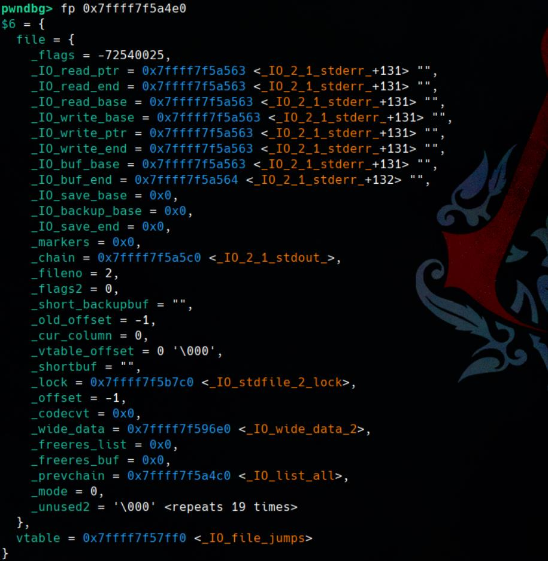

[toc]

> Update on Apr 1 2025

# GDB | Init

## `.gdbinit`

Personal configuration file `.gdbinit` under `~` which defines GDB behaviors:

```sh
source ~/pwn//pwndbg/gdbinit.py
source ~/pwn/Pwngdb/pwngdb.py
source ~/pwn/Pwngdb/angelheap/gdbinit.py

# Don't skip repeat value when use telescope
set telescope-skip-repeating-val off

# Display CPU flags
set show-flags on

# Display the Link Register (LR) in AArch64
set show-retaddr-reg on

# Set backtrace lines 4
set context-backtrace-lines 4

# Don't stop when catching a SIGALARM signal, and simply prints it
handle SIGALRM nostop print nopass

# set follow-fork-mode parent
# set detach-on-fork off

# set sourcecode directory
# directory /usr/src/glibc/glibc-2.27/malloc


# --- Define `sbase`: PIE-aware memory view
define sbase
    if $argc == 1
        telescope $rebase($arg0) 10
    end

    if $argc == 2
        telescope $rebase($arg0) $arg1
    end
end

document sbase
Show memory contents at a PIE-adjusted address using telescope.

Usage:
    sbase <address>           - Show 10 entries from address + base
    sbase <address> <count>   - Show <count> entries from address + base

Note:
    - Requires a $rebase function (e.g., via Pwngdb or manual setup).
    - Useful for examining stack or heap in PIE binaries.
end


# --- Define `bbase`: PIE-aware breakpoint
define bbase
    b *$rebase($arg0)
end

document bbase
Set a breakpoint at a PIE-adjusted address.

Usage:
    bbase <offset>

Example:
    bbase 0x1234   - Breaks at (base + 0x1234)

Note:
    - Requires a $rebase function to compute the correct address.
    - Especially useful when debugging PIE binaries where fixed offsets are needed.
end


# --- Display memory in quadwords 
# Usage: dq <address> [count]
# e.g.: dq 0x601000 16
define dq
    if $argc == 1
        x /8gx $arg0
    end
    if $argc == 2
        x /$arg1gx $arg0
    end
end

# --- Display memory in doublewords (32-bit)
define dd
    if $argc == 1
        x /16wx $arg0
    end
    if $argc == 2
        x /$arg1wx $arg0
    end
end

# --- Display memory in words  (16-bit)
define dw
    if $argc == 1
        x /32hx $arg0
    end
    if $argc == 2
        x /$arg1hx $arg0
    end
end

# --- Display memory in bytes (8-bit) 
define db
    if $argc == 1
        x /64bx $arg0
    end
    if $argc == 2
        x /$arg1bx $arg0
    end
end

# --- Inject Strings & Bytes Into GDB Running Process
define inject
    if $argc == 0
        printf "Usage: inject <python-bytestr>\n"
        printf "Example: inject 'b\"ABC\\x00\\xff\"'\n"
    else
        set $pid = $_pid
        shell python3 -c "import sys; sys.stdout.buffer.write($arg0)" > /proc/$pid/fd/0
        printf "Injected bytes into /proc/%d/fd/0\n", $pid
    end
end

document inject
Inject arbitrary bytes into the debuggee's stdin using /proc/<pid>/fd/0.

Usage:
    inject 'b"ABC\\x00\\xff"'

Note:
    - Make sure the process is paused at a point where it is waiting for input (e.g., fgets/read).
    - This uses python3 to write binary-safe payloads.

Example:
    (gdb) inject 'b"A"*64 + b"\\xef\\xbe\\xad\\xde"'
end


# --- Enable Pwngdb from https://github.com/scwuaptx/Pwngdb
define hook-run
python
import angelheap
angelheap.init_angelheap()
end
end

set debuginfod enabled on

# --- decomp2dbg from https://github.com/mahaloz/decomp2dbg
source ~/.d2d.py
```


# GDB | Start

## Exec Template

```bash
#!/bin/sh

gdb -q \
    -ex "" \
    -ex "" \
    -ex "" \
    ./pwn
```

## Set PATH

Customize `LD_LIBRARY_PATH`:

```bash
gdb -q \
	--args ./ld-2.35.so \
    --library-path ./libc-2.35.so.6 \
    ./pwn
```

## Other Sets

Config arguments for runtime:

```
set args <args>
```

Display set arguments:

```
show args
```

Config path for binary:

```
path dir
```

Display set path:

```
show paths
```

Config environment variables:

```c
set environment <var=value>
```


# GDB | Config

## LD & Glibc

```sh
set exec-wrapper ./ld-linux-x86-64.so.2 --library-path ./
# set environment LD_LIBRARY_PATH=./
```

## Configuration

Check current configurations:

```sh
gdb --configuration
```

Example:

```sh
$ gdb --configuration
This GDB was configured as follows:
   configure --host=x86_64-pc-linux-gnu --target=x86_64-pc-linux-gnu
             --with-auto-load-dir=$debugdir:$datadir/auto-load
             --with-auto-load-safe-path=$debugdir:$datadir/auto-load
             --with-expat
             --with-gdb-datadir=/usr/share/gdb (relocatable)
             --with-jit-reader-dir=/usr/lib/gdb (relocatable)
             --without-libunwind-ia64
             --with-lzma
             --without-babeltrace
             --without-intel-pt
             --with-xxhash
             --with-python=/usr (relocatable)
             --with-python-libdir=/usr/lib (relocatable)
             --with-debuginfod
             --with-curses
             --with-guile
             --without-amd-dbgapi
             --enable-source-highlight
             --enable-threading
             --enable-tui
             --with-system-readline
             --with-separate-debug-dir=/usr/lib/debug (relocatable)
             --with-system-gdbinit=/etc/gdb/gdbinit
```

## Verbose Exception

```sh
set exception-verbose on
set exception-debugger on
```

## Ptrace Priv

If we try to attach a detached child process running `gdb attach <child_pid>`, GDB probably will fail, with output:

```sh
attach: No such file or directory.
Attaching to process 6655
ptrace: Operation not permitted.
```

It could because the process is running as a different user. And GDB lacks sufficient privileges (e.g., requires `sudo` or `ptrace` capabilities). 

On modern Linux systems, `ptrace` can be restricted by security mechanisms such as YAMA (e.g., `ptrace_scope` setting). If we check the file:

```sh
$ cat /proc/sys/kernel/yama/ptrace_scope
1
```

A value of `1` or higher might restrict attaching to processes. We can temporarily change it to `0` for debugging:

```sh
$ sudo sysctl -w kernel.yama.ptrace_scope=0
kernel.yama.ptrace_scope = 0
$ cat /proc/sys/kernel/yama/ptrace_scope
0
```

**Permanent Change**: 

```sh
echo "kernel.yama.ptrace_scope=0" | sudo tee -a /etc/sysctl.conf
echo "kernel.yama.ptrace_scope=0" | sudo tee -a /etc/sysctl.d/99-ptrace.conf
sudo sysctl --system
```

## Disable Skipping Stack View

By default, Pwndbg skips same data in stack view for simplicity, for example:

```c
pwndbg> stack 0x20
00:0000│ rsi rsp 0x7fffffffd670 ◂— 0x6161616161616161 ('aaaaaaaa')
... ↓            7 skipped
08:0040│-010     0x7fffffffd6b0 —▸ 0x4c17d0 —▸ 0x401780 ◂— endbr64 
09:0048│-008     0x7fffffffd6b8 ◂— 0xaddb33bf2cb27700
0a:0050│ rbp     0x7fffffffd6c0 —▸ 0x7fffffffd6d0 ◂— 1
0b:0058│+008     0x7fffffffd6c8 —▸ 0x40186b ◂— endbr64
```

But sometimes we will need a full-scale view to debug. To stop skipping repeated values in the telescope view, use the following command:

```sh
pwndbg> set telescope-skip-repeating-val off
Set whether to skip repeating values of the telescope command to 'off'.
```

**Make the Change Permanent**: Edit `.gdbinit` file, adding the following line:

```sh
set telescope-skip-repeating-val off
```


# GDB | Debug Symbols

```sh
show debug-file-directory
set debug-file-directory /path/to/lib/.debug/
info share 
```


# GDB | Attach

Run the binary by specifying `LD_LIBRARY_PATH`:

```sh
LD_LIBRARY_PATH=/path/to/custom/libc /path/to/ld --library-path /path/to/libc ./binary
```

`CTRL Z` to background the process, Get `PID`, and attach it to GDB:

```sh
ps aux | grep <binary_file_name>
gdb -p <PID>
```


# GDB | X

## X | Format

```sh
x /[n][f][u] <address>
```

- **`/`: Format specifiers**
- **`[n]`: Number of units to display**
- **`[f]` : Format**
  - `x`: Hexadecimal
  - `d`: Decimal
  - `u`: Unsigned Decimal
  - `o`: Octal
  - `t`: Binary
  - `a`: Address
  - `i`: Instruction (disassembly)
  - `c`: Character
  - `s`: String
- **`[u]`: Unit size**
  - `b`: Byte
  - `h`: Hafword
  - `w`: Word
  - `g`: Giant word

## X | Examples

Codes: [link](https://github.com/4xura/GDB_Debug_Skills/blob/main/Codes/gdb_x.c)

### Examine a Global Variable

```c
pwndbg> x &global_var
0x555555558018 <global_var>:    0x12345678
```

If any of `[n]`, `[f]`, or `[u]` are omitted, GDB uses defaults:

- Default format: `x` (hexadecimal)
- Default unit size: `w` (word)
- Default count: `1`

### Inspect Multiple Words

```c
pwndbg> x/4x &global_var
0x555555558018 <global_var>:    0x0000000012345678      0x47202c6f6c6c6548
0x555555558028 <global_str+8>:  0x4048f5c300214244      0x0000000000000000
```

### Examine a String

Display strings until hitting null terminator:

```c
pwndbg> x/s &global_str
0x555555558020 <global_str>:    "Hello, GDB!"
```

### Examine a Float

```c
pwndbg> x/f &global_float
0x55555555802c <global_float>:  3.1400001
```

### Disassemble Instructions

Disassembles 10 instructions starting from the `main` function:

```c
pwndbg> x/10i main
   0x555555555139 <main>:       push   rbp
   0x55555555513a <main+1>:     mov    rbp,rsp
   0x55555555513d <main+4>:     sub    rsp,0x10
=> 0x555555555141 <main+8>:     mov    DWORD PTR [rbp-0x4],0xdeadbeef
   0x555555555148 <main+15>:    lea    rax,[rip+0xeb5]        # 0x555555556004
   0x55555555514f <main+22>:    mov    rdi,rax
   0x555555555152 <main+25>:    call   0x555555555030 <puts@plt>
   0x555555555157 <main+30>:    mov    eax,0x0
   0x55555555515c <main+35>:    leave
   0x55555555515d <main+36>:    ret
```

### Examine a Local Variable

After setting a breakpoint after `test_function`, display the value of `local_var` in hexadecimal format, which is on the stack and only exists while `test_function()` is executing

```c
pwndbg> x/x &local_var
0x7fffffffd7fc: 0xdeadbeef
```

Display a local string:

```c
pwndbg> x/s &local_str
0x7fffffffd80b: "Local String"
```

Display a dynamically set variable after `malloc`:

```c
pwndbg> x/x dynamic_var
0x5555555596b0: 0x00000000feedface
```

### Explore Stack Memory

Display 16 words of memory starting at the current stack pointer (`$rsp`):

```c
pwndbg> x/16x $rsp
0x7fffffffd7f0: 0x00000018      0x00000000      0x00000000      0xdeadbeef
0x7fffffffd800: 0xff000000      0x00000000      0x00000000      0x00000000
0x7fffffffd810: 0x2f2f2f2f      0x2f2f2f2f      0xdc7b3300      0x491ba903
0x7fffffffd820: 0xffffd830      0x00007fff      0x555552d2      0x00005555
```

### Examine Memory Byte by Byte

Display the first 8 bytes of `global_var` in hexadecimal format, one byte at a time:

```c
pwndbg> x/8b &global_var
0x555555558038 <global_var>:    0x78    0x56    0x34    0x12    0x00    0x00    0x00    0x00
```

### Examine Memory as Characters

Display `global_str` character by character, including the null terminator:

```c
pwndbg> x/12c &global_str
0x555555558040 <global_str>:    72 'H'  101 'e' 108 'l' 108 'l' 111 'o' 44 ','  32 ' '  71 'G'
0x555555558048 <global_str+8>:  68 'D'  66 'B'  33 '!'  0 '\000'
```

### Examine Memory in Binary Format

Display `global_var` in binary format, showing its bit-level representation:

```c
pwndbg> x/4t &global_var
0x555555558038 <global_var>:    0000000000000000000000000000000000010010001101000101011001111000        0100011100100000001011000110111101101100011011000110010101001000
0x555555558048 <global_str+8>:  0100000001001000111101011100001100000000001000010100001001000100        0000000000000000000000000000000000000000000000000000000000000000
```

- Displays `global_var` in binary format, showing its bit-level representation.

### Explore Memory Addresses

Display the memory address of `global_var`.

```c
pwndbg> x/a &global_var
0x555555558038 <global_var>:    0x12345678
```


# GDB | Set

Code: [link](https://github.com/4xura/GDB_Debug_Skills/blob/main/Codes/gdb_set.c)

Set a breakpoint before return and compare modified value with the original ones.

## Set | Syntax

```c
set {<type>} <address> = <value>
```

- **`<type>`**: Specifies the data type of the memory content to modify (e.g., `int`, `char`, `float`).
- **`<address>`**: The memory address to modify.
- **`<value>`**: The new value to set at the specified address.

##  Set | Memory Address

The syntax for modifying memory is:

```c
pwndbg> set {int} &global_var = 0xdeadbeef
pwndbg> x &global_var
0x555555558038 <global_var>:    0xdeadbeef
```

## Set | Registers

Inspect registers with command `info registers` or `regs`. 

```c
pwndbg> regs
*RAX  0
...
pwndbg> set $rax = 0x1234
pwndbg> regs
*RAX  0x1234
...
```

## Set | String

Set a global string to a new value:

```c
pwndbg> x &global_str
0x555555558040 <global_str>:    0x6c6c6548
pwndbg> x/s &global_str
0x555555558040 <global_str>:    "Hello, GDB!"
pwndbg> set global_str[0] = 'X'
pwndbg> x/s &global_str
0x555555558040 <global_str>:    "Xello, GDB!"
```

## Set | Variable

```c
set variable <variable_name> = <value>
```


# GDB | Break

## Conditional Breakpoints

```c
break <file>:<line> if <condition>
```

or

```c
break <address> if <condition>
```

### Temp Breakpoints

```c#
tbreak <line/function>
```

### Delete & Disable

```c
delete <breakpoint_nubmer>
disable <breakpoint_nubmer>
enable <breakpoint_nubmer>
```

### Ignore

Ignore specific breakpoint for specific times:

```c
ignore <breakpoint_nubmer> <count>
```


# GDB | Watch

## Basic Usage

Monitor value change on variable `myVar`:

```sh
watch myVar
watch (myVar > 10)
```

Monitor data inside an address:

```sh
watch *<address>
```

Monitor a pointer value:

```sh
wathc *<ptr>
```

Monitor 4 bytes of read/write:

```sh
watch *(int *)<address>
```

Monitor 8 bytes of read/write:

```sh
watch *(long long int*)<address>
```

**Read watch:**

```c
rwatch <expression>
```

**Access watch (read/write)**:

```c
awatch <expression>
```

## Example

Code: [link](https://github.com/4xura/GDB_Debug_Skills/blob/main/Codes/gdb_watch.c)

Set a **read watchpoint** to break when `global_var` is accessed:

```c
pwndbg> rwatch global_var
Hardware read watchpoint 1: global_var
```

Set an **access watchpoint** to break when `global_var` is read or written:

```c
pwndbg> awatch global_var
Hardware access (read/write) watchpoint 2: global_var
```

Run and inspect breakpoints:

```c
pwndbg> r

pwndbg> i b
Num     Type            Disp Enb Address            What
1       read watchpoint keep y                      global_var
        breakpoint already hit 1 time
2       acc watchpoint  keep y                      global_var
        breakpoint already hit 1 time
```

View initial value of the global variable when the first breakpoints hit:

```c
pwndbg> p global_var
$1 = 0
```

Continue the program as breakpoints are hit, inspect the values of the global variable for example:

```c
pwndbg> i b
Num     Type            Disp Enb Address            What
1       read watchpoint keep y                      global_var
        breakpoint already hit 2 times
2       acc watchpoint  keep y                      global_var
        breakpoint already hit 2 times
        
pwndbg> p global_var
$7 = 10
```


# GDB | Catch

Catch a breakpoint at specific function call:

```sh
catch <func>

# example
catch exec
catch fork
```

Catch a syscall and set a breakpoint:

```sh
catch syscall <num|name>

# example
catch syscall read
```

Catch a signal and set a breakpoint:

```sh
catch signal <name|id>

# example
catch signal SIGTRAP
catch signal SIGSEGV
```

Catch an assert, used to **break execution when an `assert()` fails** in the program:

```sh
cat assert
```


# GDB | Threads

Code: [link](https://github.com/4xura/GDB_Debug_Skills/blob/main/Codes/gdb_thread.c)

## Thread | List

Syntax:

```c
info threads
```

Example:

```c
pwndbg> i threads
  Id   Target Id                                      Frame 
* 1    Thread 0x7ffff7d92740 (LWP 5714) "gdb_threads" 0x00007ffff7e25a19 in ?? () from /usr/lib/libc.so.6
  2    Thread 0x7ffff7d916c0 (LWP 5715) "gdb_threads" 0x00007ffff7e76733 in clock_nanosleep ()
   from /usr/lib/libc.so.6
  3    Thread 0x7ffff75906c0 (LWP 5716) "gdb_threads" 0x00007ffff7e76733 in clock_nanosleep ()
   from /usr/lib/libc.so.6
  4    Thread 0x7ffff6d8f6c0 (LWP 5717) "gdb_threads" 0x00007ffff7e76733 in clock_nanosleep ()
   from /usr/lib/libc.so.6
```

## Thread | Switch

Syntax:

```c
thread <thread-id>
backtrace
```

Example:

```c
pwndbg> thread 2
[Switching to thread 2 (Thread 0x7ffff7d916c0 (LWP 5963))]
#0  0x00007ffff7e76733 in clock_nanosleep () from /usr/lib/libc.so.6
pwndbg> bt
#0  0x00007ffff7e76733 in clock_nanosleep () from /usr/lib/libc.so.6
#1  0x00007ffff7e82827 in nanosleep () from /usr/lib/libc.so.6
#2  0x00007ffff7e94f41 in sleep () from /usr/lib/libc.so.6
#3  0x000055555555523d in worker_function (arg=0x7fffffffd7f4) at gdb_threads.c:21
#4  0x00007ffff7e2939d in ?? () from /usr/lib/libc.so.6
#5  0x00007ffff7eae49c in ?? () from /usr/lib/libc.so.6
```

## Thread | Break

Syntax:

```c
break <address> thread <thread-id>
```

## Thread | Watch

Syntax:

```c
watch <variable_name> thread <thread-id>
```

Example:

```c
pwndbg> watch counter thread 3
Hardware watchpoint 1: counter
```

## Thread | Detach

Detach a thread and let it run independently:

```c
detach <thread_id>
```

Example:

```c
pwndbg> t 4
[Switching to thread 4 (Thread 0x7ffff6d8f6c0 (LWP 6120))]
Downloading 3.14 K source file /usr/src/debug/glibc/glibc/time/../sysdeps/unix/sysv/linux/clock_nanosleep.c
#0  0x00007ffff7e76733 in __GI___clock_nanosleep (clock_id=clock_id@entry=0, flags=flags@entry=0,                    
    req=req@entry=0x7ffff6d8ee60, rem=rem@entry=0x7ffff6d8ee60) at ../sysdeps/unix/sysv/linux/clock_nanosleep.c:48
48        r = INTERNAL_SYSCALL_CANCEL (clock_nanosleep_time64, clock_id, flags, req,
pwndbg> detach
Thread 3 incremented counter to 7
Detaching from program: /home/Axura/pwn/gdb_debug_skills/gdb_threads, process 6115
Thread 2 incremented counter to 8
Thread 1 incremented counter to 9
[Inferior 1 (process 6115) detached]
pwndbg> Thread 1 incremented counter to 10
Thread 2 incremented counter to 11
Thread 3 incremented counter to 12
Thread 2 incremented counter to 13
Thread 1 incremented counter to 14
Thread 3 incremented counter to 15
Final counter value: 15
```

## Thread | Scheduler-locking

The `set scheduler-locking` command in GDB controls how threads are scheduled during debugging.

1. **`off` (Default)**
   - All threads are allowed to run freely during program execution.
   - When we issue a stepping command (`step`, `next`), the program may switch between threads based on the operating system's thread scheduling.
   - Use this when we want the program to run as naturally as possible.
2. **`on`**
   - Only the current thread executes, while all other threads remain paused.
   - Use this to focus exclusively on a single thread without interference from other threads.
3. **`step`**
   - Similar to `on`, but with one key difference:
     When we issue stepping commands like `step` or `next`, only the current thread runs. However, if we use a continuation command like `continue`, all threads will resume execution.
   - This option strikes a balance between isolating a single thread for stepping and letting the program continue naturally when needed.

**Usage**

Switch to the thread we want to debug:

```c
thread 2
```

**Make sure only the current thread run**:

```sh
set scheduler-locking on
```

Set `scheduler-locking` to `step`:

```c
set scheduler-locking step
set scheduler-locking si
```

Debug with:

```c
// Step current thread
s
// Run all threads
c
```

## Thread | No-stop

Controls whether **all threads stop** when **one thread hits a breakpoint or signal**.

```sh
set non-stop on
set non-stop off
```

- **`on`**: Only the thread that hits the breakpoint (or signal) stops. Other threads **keep running**.
- **`off`** (default): **All threads stop** when one hits a breakpoint.

Useful for debugging **live systems** or **multi-threaded programs** where we don’t want all threads paused. Critical when debugging concurrent behaviors like race conditions or async I/O.

## Thread | Async

Enables **asynchronous execution** of the debugged program—i.e., GDB doesn’t block while the program is running.

```sh
set target-async on/off
```

- **`on`**: GDB lets the program run in the background, and we can continue typing commands while it's running.
- **`off`**: GDB blocks and waits for the target to stop before returning control to us.

## Thread | Bt

Backtrace for all threads:

```c
thread apply all bt 
```

Example:

```c
pwndbg> t apply all bt 

Thread 4 (Thread 0x7ffff6d8f6c0 (LWP 2988) "gdb_threads"):
#0  0x00007ffff7e76733 in __GI___clock_nanosleep (clock_id=clock_id@entry=0, flags=flags@entry=0, req=req@entry=0x7ffff6d8ee60, rem=rem@entry=0x7ffff6d8ee60) at ../sysdeps/unix/sysv/linux/clock_nanosleep.c:48
#1  0x00007ffff7e82827 in __GI___nanosleep (req=req@entry=0x7ffff6d8ee60, rem=rem@entry=0x7ffff6d8ee60) at ../sysdeps/unix/sysv/linux/nanosleep.c:25
#2  0x00007ffff7e94f41 in __sleep (seconds=0) at ../sysdeps/posix/sleep.c:55
#3  0x000055555555523d in worker_function (arg=0x7fffffffd7bc) at gdb_threads.c:21
#4  0x00007ffff7e2939d in start_thread (arg=<optimized out>) at pthread_create.c:447
#5  0x00007ffff7eae49c in __GI___clone3 () at ../sysdeps/unix/sysv/linux/x86_64/clone3.S:78

Thread 3 (Thread 0x7ffff75906c0 (LWP 2987) "gdb_threads"):
#0  0x00007ffff7e76733 in __GI___clock_nanosleep (clock_id=clock_id@entry=0, flags=flags@entry=0, req=req@entry=0x7ffff758fe60, rem=rem@entry=0x7ffff758fe60) at ../sysdeps/unix/sysv/linux/clock_nanosleep.c:48
#1  0x00007ffff7e82827 in __GI___nanosleep (req=req@entry=0x7ffff758fe60, rem=rem@entry=0x7ffff758fe60) at ../sysdeps/unix/sysv/linux/nanosleep.c:25
#2  0x00007ffff7e94f41 in __sleep (seconds=0) at ../sysdeps/posix/sleep.c:55
#3  0x000055555555523d in worker_function (arg=0x7fffffffd7b8) at gdb_threads.c:21
#4  0x00007ffff7e2939d in start_thread (arg=<optimized out>) at pthread_create.c:447
#5  0x00007ffff7eae49c in __GI___clone3 () at ../sysdeps/unix/sysv/linux/x86_64/clone3.S:78

Thread 2 (Thread 0x7ffff7d916c0 (LWP 2986) "gdb_threads"):
#0  0x00007ffff7e76733 in __GI___clock_nanosleep (clock_id=clock_id@entry=0, flags=flags@entry=0, req=req@entry=0x7ffff7d90e60, rem=rem@entry=0x7ffff7d90e60) at ../sysdeps/unix/sysv/linux/clock_nanosleep.c:48
#1  0x00007ffff7e82827 in __GI___nanosleep (req=req@entry=0x7ffff7d90e60, rem=rem@entry=0x7ffff7d90e60) at ../sysdeps/unix/sysv/linux/nanosleep.c:25
#2  0x00007ffff7e94f41 in __sleep (seconds=0) at ../sysdeps/posix/sleep.c:55
#3  0x000055555555523d in worker_function (arg=0x7fffffffd7b4) at gdb_threads.c:21
#4  0x00007ffff7e2939d in start_thread (arg=<optimized out>) at pthread_create.c:447
#5  0x00007ffff7eae49c in __GI___clone3 () at ../sysdeps/unix/sysv/linux/x86_64/clone3.S:78

Thread 1 (Thread 0x7ffff7d92740 (LWP 2982) "gdb_threads"):
#0  0x00007ffff7e25a19 in __futex_abstimed_wait_common64 (private=128, futex_word=0x7ffff7d91990, expected=2986, op=265, abstime=0x0, cancel=true) at futex-internal.c:57
#1  __futex_abstimed_wait_common (futex_word=futex_word@entry=0x7ffff7d91990, expected=2986, clockid=clockid@entry=0, abstime=abstime@entry=0x0, private=private@entry=128, cancel=cancel@entry=true) at futex-internal.c:87
#2  0x00007ffff7e25a9f in __GI___futex_abstimed_wait_cancelable64 (futex_word=futex_word@entry=0x7ffff7d91990, expected=<optimized out>, clockid=clockid@entry=0, abstime=abstime@entry=0x0, private=private@entry=128) at futex-internal.c:139
#3  0x00007ffff7e2b1a3 in __pthread_clockjoin_ex (threadid=140737351587520, thread_return=0x0, clockid=0, abstime=0x0, block=<optimized out>) at pthread_join_common.c:102
#4  0x0000555555555303 in main () at gdb_threads.c:44
#5  0x00007ffff7dbae08 in __libc_start_call_main (main=main@entry=0x55555555524e <main>, argc=argc@entry=1, argv=argv@entry=0x7fffffffd908) at ../sysdeps/nptl/libc_start_call_main.h:58
#6  0x00007ffff7dbaecc in __libc_start_main_impl (main=0x55555555524e <main>, argc=1, argv=0x7fffffffd908, init=<optimized out>, fini=<optimized out>, rtld_fini=<optimized out>, stack_end=0x7fffffffd8f8) at ../csu/libc-start.c:360
#7  0x00005555555550f5 in _start ()
```


# GDB | Signal

Show current signal configuration

```sh
i signal
```

Sends a signal (e.g., `SIGINT`, `SIGTERM`, etc.) to the running process. We can send numeric signals (e.g., `signal 11` for `SIGSEGV`) or symbolic ones (`signal SIGINT`):

```sh
signal <signo|name>
```

Continue execution without sending any signal. Resumes the program but **discards the current signal **(Useful if GDB stopped on a signal and we want to ignore it while continuing):

```sh
signal 0
```

Print or suppress signal output:

```sh
handle <signo> print/noprint
```

Stop or not on signal reception:

```sh
handle <signo> stop/nostop
```

Pass or block signal to the debuggee:

```sh
handle <signo> pass/nopass
```

**Usual setting**:

```sh
handle SIGALRM nostop print nopass
```

- **`nostop`**: Don't stop execution when `SIGALRM` is received.
- **`print`**: Show it in the terminal.
- **`nopass`**: Don't forward the signal to the target process.

This is useful when debugging a program that uses `alarm()` or timers, and we don’t want those signals interfering with your session (unless we do rely on this signal to process custom execution flow).


# GDB | Display

Lists all currently active **display expressions**.

```sh
info display
```

Automatically prints a variable or expression on every stop.

```sh
display <FMT> <expr>

# example
display /x my_var       # hex format
display /t flag         # binary
display /f my_float     # float
display /a ptr          # address
```

`{FMT}` is a format specifier (optional):

- `/x` = hex
- `/d` = decimal
- `/u` = unsigned
- `/t` = binary
- `/f` = float
- `/a` = address
- `/c` = character

Stops displaying the expression with the given number (from `info display`):

```sh
undisplay <id>
```

Example use case:

```sh
pwndbg> display $rax
1: $rax = 93824992235849

pwndbg> display /x $rax
2: /x $rax = 0x555555555149

pwndbg> n
4           char arr1[] = "bit";         // Null-terminated string, stored as {'b', 'i', 't', '\0'}.
1: $rax = 0
2: /x $rax = 0x0

pwndbg>
5           char arr2[3] = "bit";        // Compiler warning: no space for the null character.
1: $rax = 0
2: /x $rax = 0x0
```


# GDB | Dprintf

Sets a **dynamic printpoint** (a special breakpoint) that prints values **without stopping** program execution:

```sh
dprintf <location>, <format_string>, <arg1>, <arg2> ,,,
```

For example:

```sh
dprintf main, "argc = %d\n", argc
dprintf myfunc:42, "x=%d, y=%d\n", x, y
```

Lists all breakpoints, including those created by `dprintf`:

```sh
info breakpoints
```

Example use case:

```sh
pwndbg> l
1       #include <stdio.h>
2
3       int main() {
4           char arr1[] = "bit";         // Null-terminated string, stored as {'b', 'i', 't', '\0'}.
5           char arr2[3] = "bit";        // Compiler warning: no space for the null character.
6           char arr3[] = {'b', 'i', 't'}; // Not null-terminated.
7           char arr4[] = {'b', 'i', 't', '\0'}; // Explicit null character.
8
9           printf("%s\n", arr1); // Prints "bit".
10          printf("%s\n", arr2); // Undefined behavior (not null-terminated).
pwndbg>
11          printf("%s\n", arr3); // Undefined behavior (not null-terminated).
12          printf("%s\n", arr4); // Prints "bit".
13
14          return 0;
15      }

pwndbg> dprintf 9, "[!!!] Caution\n We found arr1 = %s\n", arr1
Dprintf 1 at 0x1182: file strings_example.c, line 9.

pwndbg> i b
Num     Type           Disp Enb Address            What
1       dprintf        keep y   0x0000000000001182 in main at strings_example.c:9
        printf "[!!!] Caution\n We found arr1 = %s\n", arr1

pwndbg> r
Starting program: /home/Axura/pwn/test/strings_example
Download failed: No route to host.  Continuing without separate debug info for system-supplied DSO at 0x7ffff7fc4000.
[Thread debugging using libthread_db enabled]
Using host libthread_db library "/usr/lib/libthread_db.so.1".
[!!!] Caution
We found arr1 = bit
bit
bitbitbit
bitbit
bit
```


# GDB | Disassemble

Disassemble starting at `start`, for `len` bytes:

```sh
disassemble <start>,+<len>
```

Disassemble the instruction range from `start` to `end`:

```sh
disassemble <start>,<end>
```

**Example**

Code: [link](https://github.com/4xura/GDB_Debug_Skills/blob/main/Codes/gdb_asm.c)

**Disassemble the function:**

```c
pwndbg> disassemble add_numbers
Dump of assembler code for function add_numbers:
   0x0000555555555139 <+0>:       push   rbp
   0x000055555555513a <+1>:       mov    rbp,rsp
   0x000055555555513d <+4>:       mov    DWORD PTR [rbp-0x14],edi
   0x0000555555555140 <+7>:       mov    DWORD PTR [rbp-0x18],esi
   0x0000555555555143 <+10>:      mov    edx,DWORD PTR [rbp-0x14]
   0x0000555555555146 <+13>:      mov    ecx,DWORD PTR [rbp-0x18]
   0x0000555555555149 <+16>:      mov    eax,edx
   0x000055555555514b <+18>:      add    eax,ecx
   0x000055555555514d <+20>:      mov    edx,eax
   0x000055555555514f <+22>:      mov    DWORD PTR [rbp-0x4],edx
   0x0000555555555152 <+25>:      mov    eax,DWORD PTR [rbp-0x4]
   0x0000555555555155 <+28>:      pop    rbp
   0x0000555555555156 <+29>:      ret
End of assembler dump.
```

**Switch to TUI mode for assembly view:**

```sh
layout asm
# To exit window: ctrl+x + a
```

**Set a breakpoint** in the function and **step through the assembly**:

```c
break add_numbers
run
stepi   # Step one assembly instruction
nexti   # Skip over function calls
```

**Observe register values** after each instruction:

```sh
info registers
# or in pwndbg
regs
```


# GDB | Frame

Manipulate the **stack frame **allocated when function calls.

Print the call stack (traceback), `depth` controls how deep:

```sh
backtrace <depth>

# or
bt <depth>
```

Display the current stack frame (function context):

```sh
frame
```

Move up or down in the call stack (to previous/next frame):

```sh
up
down
```

Print local variables in the current stack frame:

```sh
info locals
```

**Example**:

```sh
pwndbg> bt
#0  main () at pthread_attr_demo.c:35
#1  0x00007ffff7db8488 in __libc_start_call_main (main=main@entry=0x555555555208 <main>, argc=argc@entry=1, argv=argv@entry=0x7fffffffd8e8)
at ../sysdeps/nptl/libc_start_call_main.h:58
#2  0x00007ffff7db854c in __libc_start_main_impl (main=0x555555555208 <main>, argc=1, argv=0x7fffffffd8e8, init=<optimized out>, fini=<optimized out>,
rtld_fini=<optimized out>, stack_end=0x7fffffffd8d8) at ../csu/libc-start.c:360
#3  0x0000555555555105 in _start ()

pwndbg> frame
#0  main () at pthread_attr_demo.c:35
35          pthread_attr_destroy(&attr);

pwndbg> i locals
attr = {
__size = '\000' <repeats 17 times>, "\020", '\000' <repeats 16 times>, " ", '\000' <repeats 20 times>,
__align = 0
}
thread = 140737351571136
err = 0
stacksize = 2097152

pwndbg> down
► 0   0x5555555552b2 main+170
1   0x7ffff7db8488 __libc_start_call_main+120
2   0x7ffff7db854c __libc_start_main+140
3   0x555555555105 _start+37
```


# GDB | Processes

## Process | Switch

List all inferiors (processes GDB is debugging):

```c
info inferiors 
```

Switch between parent and child processes using:

```c
inferior <id>
```

## Process | Catch

Breakpoints set in the parent process before the `fork()` are copied into the child process. We can continue debugging both processes by switching between them.

- **`catch fork`**: Stops execution when a `fork()` is called.
- **`catch vfork`**: Stops execution when a `vfork()` is called.

```c
catch fork
// or
catch vfork
```

## Process | Detach-on-fork

### On | Off

**`set detach-on-fork on|off`**

- **`on`**: GDB detaches from the child process after a `fork()`. It continues to debug only the parent process (default behavior).
- **`off`**: GDB does not detach from the child process. Both parent and child processes remain under GDB control, and we can switch between them using `inferior` commands.

Example:

```c
set detach-on-fork off
```

### Parent | Child

**`set follow-fork-mode parent|child`**

- **`parent`**: GDB continues debugging the parent process after a `fork()`.
- **`child`**: GDB switches to debug the child process after a `fork()`.

Example:

```c
set follow-fork-mode child
```

### Debug Code

Code: [link](https://github.com/4xura/GDB_Debug_Skills/blob/main/Codes/gdb_processes.c)

Configures GDB to switch focus to the child process after `fork()`:

```c
pwndbg> set detach-on-fork off
pwndbg> set follow-fork-mode child
pwndbg> r
Starting program: /home/Axura/pwn/gdb_debug_skills/gdb_processes 
Downloading separate debug info for /lib64/ld-linux-x86-64.so.2
[Thread debugging using libthread_db enabled]                                                                        
Using host libthread_db library "/usr/lib/libthread_db.so.1".
Parent process: PID = 2948
[Attaching after Thread 0x7ffff7d92740 (LWP 2948) fork to child process 2952]
[New inferior 2 (process 2952)]
[Thread debugging using libthread_db enabled]
Using host libthread_db library "/usr/lib/libthread_db.so.1".
Child process: PID = 2952, Parent PID = 2948
Child process: global_var = 15
Process PID = 2952 exiting.
[Inferior 2 (process 2952) exited normally]
```

- The parent process starts (PID = 2948).
- GDB detects the `fork()` and attaches to the child process (PID = 2952) while retaining information about the parent.
- The child process executes its specific code:
  - Prints its `PID` and parent `PID`.
  - Updates the `global_var` to 15 and prints it.
- The child process exits normally, and GDB remains ready for further actions.

To debug the parent process as well, you can switch back to it using:

```c
pwndbg> inferior 1
[Switching to inferior 1 [process 2948] (/home/Axura/pwn/gdb_debug_skills/gdb_processes)]
[Switching to thread 1.1 (Thread 0x7ffff7d92740 (LWP 2948))]
```

Add `catch fork` to pause execution right before the `fork()`:

```c
pwndbg> catch fork
Catchpoint 1 (fork)
```

Use `info inferiors` to see all processes GDB is attached to:

```c
pwndbg> info inferiors 
  Num  Description       Connection           Executable        
* 1    process 2948      1 (native)           /home/Axura/pwn/gdb_debug_skills/gdb_processes 
  2    <null>                                 /home/Axura/pwn/gdb_debug_skills/gdb_processes
```

## Example

Code: [link](https://github.com/4xura/GDB_Debug_Skills/blob/main/Codes/gdb_watch.c)

Set a **read watchpoint** to break when `global_var` is accessed:

```c
pwndbg> rwatch global_var
Hardware read watchpoint 1: global_var
```

Set an **access watchpoint** to break when `global_var` is read or written:

```c
pwndbg> awatch global_var
Hardware access (read/write) watchpoint 2: global_var
```

Run and inspect breakpoints:

```c
pwndbg> r
pwndbg> i b
Num     Type            Disp Enb Address            What
1       read watchpoint keep y                      global_var
        breakpoint already hit 1 time
2       acc watchpoint  keep y                      global_var
        breakpoint already hit 1 time
```

View initial value of the global variable when the first breakpoints hit:

```c
pwndbg> p global_var
$1 = 0
```

Continue the program as breakpoints are hit, inspect the values of the global variable for example:

```c
pwndbg> i b
Num     Type            Disp Enb Address            What
1       read watchpoint keep y                      global_var
        breakpoint already hit 2 times
2       acc watchpoint  keep y                      global_var
        breakpoint already hit 2 times
pwndbg> p global_var
$7 = 10
```


# GDB | Checkpoint

**GDB’s `checkpoint` feature** allows us to **save and restore the execution state** of a program mid-debugging — very useful for exploring alternate paths without restarting everything.

Saves the current state of program execution (memory, registers, etc.):

```
checkpoint
```

Think of it like a **save state** in an emulator — lets us return to this point later.

Lists all saved checkpoints, each with an **ID**, **location**, and **status**:

```sh
info checkpoints
```

Removes a specific checkpoint by ID to free memory or clean up:

```sh
delete checkpoint <id>
```

**Restores execution to the state** of a given checkpoint (by ID):

```sh
restart <id>
```

Typical Use Case:

```sh
pwndbg> b main
Breakpoint 1 at 0x113d: file g_var.c, line 7.

pwndbg> r
Starting program: /home/Axura/pwn/test/g_var

pwndbg> checkpoint
checkpoint 1: fork returned pid 2827.

pwndbg> n
pwndbg> n
pwndbg> n
...

pwndbg> i checkpoints
* 0 Thread 0x7ffff7d8e740 (LWP 2821) (main process) at 0x55555555515f, file g_var.c, line 8
1 process 2827 at 0x55555555513d, file g_var.c, line 7

pwndbg> restart
Requires argument (checkpoint id to restart)
```

This is powerful for **reversing**, exploit path testing, or state comparison — especially if we're dealing with nondeterministic behavior or race conditions.


# GDB | Record

An execution recording capabilities to help debug and analyze program state changes over time - an upgraded version of `checkpoint` command.

The `record` feature is used to **trace program execution**, allowing us to inspect past instructions, function calls, and control flow.

## Basic Usage

```bash
gdb ./pwn
```

Inside GDB:

```
pwndbg> start
pwndbg> record
```

Or some other options:

```bash
record full           # Start full execution recording
record btrace         # Start branch trace recording (less overhead)
```

We can also abbreviate:

```bash
record f              # Equivalent to record full
record b              # Equivalent to record btrace
```

Delete the current execution log and restart recording:

```sh
record delete
record del
record d
```

Stop recording:

```sh
record stop
record s
```

Save the recorded log to a file:

```sh
record save
```

Go to a specific instruction number in the log:

```sh
record goto <N>
```

Show function-level execution history:

```sh
record function-call-history
```

Print disassembled instruction history:

```sh
record instruction-history
```

## Workflow

```sh
start                        
record full
continue                     
record instruction-history  # Only when record full
reverse-stepi				# where we can step back!
record goto 100              
record stop    
```


# GDB | TTY

Allow the **debugged program** to use a **different terminal (TTY)** for I/O, while keeping GDB interaction in our main terminal.

In one terminal:

```
tty
```

Example output:

```
/dev/pts/2
```

In the **other terminal**, run GDB with the program and **attach the TTY**:

```
gdb -q --tty=/dev/pts/2 ./program
```

Then in GDB:

```
run <args...>
```

Now, the program's **input/output** will appear in `/dev/pts/2` (the first terminal), while we control GDB in the second one.

It’s recommended to run this in the I/O terminal:

```
sleep infinity
```

to **keep the terminal alive** while waiting for input/output.

Example use case:


**Using a separate TTY for GDB I/O is especially useful when debugging `qemu`-based programs**.

When we debug a **QEMU-based binary** with GDB, pressing **`Ctrl+C`** in a shared terminal:

- Sends **SIGINT (0xcc)** to **both** GDB and the **QEMU process**.
- This **kills QEMU**, potentially losing all debugging context/state.

By assigning the QEMU target program its **own terminal (TTY)** for I/O:

- `Ctrl+C` only interrupts **GDB**, not the QEMU process.
- We retain control of the debugger **without crashing** the emulated system!


# GDB | Docker

Install `gdbserver` on the docker container, and start it where the binary is running:

```sh
gdbserver 127.0.0.1:port ./pwn
```

Run the `gdb` command on the local machine:

```bash
gdb -q \
	-ex 'target remote 127.0.0.1:port'
	./pwn
```


# GDB | TUI

## TUI

The `layout` command in GDB is used to display different text-based layouts in the TUI (Text User Interface) mode. This mode enhances the debugging experience by showing various aspects of the program's state, such as source code, assembly, registers, or memory, alongside the GDB command line.

**Enter/Exit TUI Mode:**

```c
tui enable
tui disable
```

**Syntax:**

```c
layout <type>
```

**Switch Windows:**
Press `Ctrl-x` followed by `o` to cycle through different windows (source, assembly, registers, etc.).

While in TUI mode, press `Ctrl-x` followed by `1` to close all additional TUI windows and return to a single command-line window.

**Scroll Source Code:**
Use the arrow keys or `Ctrl-P` (up), `Ctrl-N` (down) to navigate the source code window.

**Scroll Assembly Instructions:**
Use the `Page Up` and `Page Down` keys or `Ctrl-U`/`Ctrl-D`.

## Layout

Displays the source code window. This is the default layout when entering TUI mode:

```c
layout src
```

Displays the disassembled instructions for the current function or address. Useful for debugging at the assembly level:

```c
layout asm
```

Displays both the source code and assembly windows side by side, allowing us to correlate source lines with assembly instructions:

```c
layout split
```

Displays a window with the current values of registers alongside the source code or assembly. This is especially helpful for low-level debugging:

```c
layout regs
```


# GDB | Core Dump

Debugging a **core dump** file is a way to analyze a program that has crashed. The core dump contains a snapshot of the program's memory and execution state at the moment of the crash. Using GDB, we can inspect this snapshot to identify the cause of the crash.

## Ulimit

By default, many Linux systems disable core dumps. We can enable them in the shell:

```sh
ulimit -c unlimited
```

This allows the system to generate core dump files when a program crashes.

We can make this setting permanent by adding it to our shell's configuration file (e.g., `.zshrc`) or by modifying `/etc/security/limits.conf`.

## Dump

Run the program as usual. If it crashes, a core dump file will be generated, typically named `core` or `core.<pid>`.

For example:

```sh
./myprogram
Segmentation fault (core dumped)
```

## Coredumpctl

Modern Linux systems use `core_pattern` to define where core dumps are stored. Check the current pattern with:

```sh
cat /proc/sys/kernel/core_pattern
```

**Check the Core Dump List** managed by `systemd-coredump`:

```sj
coredumpctl list
```

**View Core Dump Details**:

```
coredumpctl info <PID>
```

**Access or Save the Core Dump**:

```sh
coredumpctl dump <PID> > core
```

This saves the core dump to a file named `core` in the current directory.

## Debug

Run GDB, specifying both the executable and the core dump file:

```sh
gdb myprogram core
```

GDB will load the program and the core dump, showing information about the crash.

## Example

Code: [link](https://github.com/4xura/GDB_Debug_Skills/blob/main/Codes/gdb_crash.c)

**Crash with core dumped:**

```sh
ulimit -c unlimited
./gdb_crash
Program is about to crash...
[1]    8416 segmentation fault (core dumped)  ./gdb_crash
```

**List core dumps:**

```sh
$ coredumpctl list
TIME                           PID  UID  GID SIG     COREFILE EXE                                                   >
Thu 2024-11-14 23:01:05 PST   1739 1000 1000 SIGABRT missing  /usr/bin/dolphin                                      >
Thu 2024-11-14 23:02:49 PST   1929 1000 1000 SIGABRT missing  /usr/bin/dolphin                                      >
Fri 2024-11-15 18:26:06 PST   1022 1000 1000 SIGABRT missing  /usr/lib/kf6/baloo_file                               >
Sat 2024-11-16 00:15:10 PST   1174 1000 1000 SIGSEGV missing  /usr/bin/plasmashell                                  >
Sat 2024-11-16 00:29:45 PST   4287 1000 1000 SIGSEGV missing  /usr/bin/plasmashell                                  >
Sat 2024-11-16 00:39:10 PST   4929 1000 1000 SIGSEGV missing  /usr/bin/plasmashell                                  >
Sat 2024-11-16 01:09:53 PST   5284 1000 1000 SIGSEGV missing  /usr/bin/plasmashell                                  >
Sat 2024-11-16 17:45:41 PST   2707 1000 1000 SIGTRAP missing  /usr/lib/electron32/electron                          >
Sat 2024-11-16 17:49:58 PST   2975 1000 1000 SIGTRAP missing  /usr/lib/electron32/electron                          >
Sat 2024-11-16 17:50:07 PST   3462 1000 1000 SIGTRAP missing  /usr/lib/electron32/electron                          >
Sat 2024-11-16 17:50:19 PST   3648 1000 1000 SIGTRAP missing  /usr/lib/electron32/electron                          >
Sat 2024-11-16 17:50:37 PST   3829 1000 1000 SIGTRAP missing  /usr/lib/electron32/electron                          >
Sat 2024-11-16 18:49:36 PST  12106    0    0 SIGTRAP none     /home/Axura/hacktools/BloodHound-linux-x64/BloodHound >
Sat 2024-11-16 18:49:48 PST  12431    0    0 SIGTRAP none     /home/Axura/hacktools/BloodHound-linux-x64/BloodHound >
Sat 2024-11-16 18:58:50 PST   1026 1000 1000 SIGSEGV present  /usr/lib/kf6/baloo_file                               >
Sat 2024-11-16 23:21:16 PST   1036 1000 1000 SIGSEGV present  /usr/lib/kf6/baloo_file                               >
Fri 2024-11-22 00:20:41 PST 117392 1000 1000 SIGTRAP present  /usr/lib/electron32/electron                          >
Fri 2024-11-22 00:21:00 PST 117641 1000 1000 SIGTRAP present  /usr/lib/electron32/electron                          >
Sat 2024-11-23 20:26:56 PST  10388 1000 1000 SIGSEGV present  /usr/bin/wireshark                                    >
Sat 2024-11-30 18:48:05 PST   8416 1000 1000 SIGSEGV present  /home/Axura/pwn/gdb_debug_skills/gdb_crash
```

**View core dump detais:**

```sh
$ coredumpctl info 8416
           PID: 8416 (gdb_crash)
           UID: 1000 (Axura)
           GID: 1000 (Axura)
        Signal: 11 (SEGV)
     Timestamp: Sat 2024-11-30 18:48:05 PST (13min ago)
  Command Line: ./gdb_crash
    Executable: /home/Axura/pwn/gdb_debug_skills/gdb_crash
 Control Group: /user.slice/user-1000.slice/user@1000.service/app.slice/app-org.kde.konsole\x20\x281\x29@ea52d423206>
          Unit: user@1000.service
     User Unit: app-org.kde.konsole\x20\x281\x29@ea52d423206244b9aee4dd8c874f35e2.service
         Slice: user-1000.slice
     Owner UID: 1000 (Axura)
       Boot ID: 169ecd2ee4ee4f8aa9e8bfaff8ff244a
    Machine ID: 2a180b57a01b47d2b908871416ec7367
      Hostname: arLinuxA
       Storage: /var/lib/systemd/coredump/core.gdb_crash.1000.169ecd2ee4ee4f8aa9e8bfaff8ff244a.8416.1733021285000000>
  Size on Disk: 19.1K
       Message: Process 8416 (gdb_crash) of user 1000 dumped core.
                
                Stack trace of thread 8416:
                #0  0x000060111f49c149 n/a (/home/Axura/pwn/gdb_debug_skills/gdb_crash + 0x1149)
                #1  0x000060111f49c16f n/a (/home/Axura/pwn/gdb_debug_skills/gdb_crash + 0x116f)
                #2  0x00007a8e18618e08 n/a (libc.so.6 + 0x25e08)
                #3  0x00007a8e18618ecc __libc_start_main (libc.so.6 + 0x25ecc)
                #4  0x000060111f49c065 n/a (/home/Axura/pwn/gdb_debug_skills/gdb_crash + 0x1065)
                ELF object binary architecture: AMD x86-64
```

**Save core dump in current directory: **

```sh
$ coredumpctl dump 8416 > core
```

**Debug with core dump:**

```sh
gdb gdb_crash core
```

**Backtrace to see the function calls:**

```c
pwndbg> bt
#0  0x000060111f49c149 in faulty_function () at gdb_crash.c:6
#1  0x000060111f49c16f in main () at gdb_crash.c:11
#2  0x00007a8e18618e08 in __libc_start_call_main (main=main@entry=0x60111f49c152 <main>, argc=argc@entry=1, 
    argv=argv@entry=0x7fff1db153c8) at ../sysdeps/nptl/libc_start_call_main.h:58
#3  0x00007a8e18618ecc in __libc_start_main_impl (main=0x60111f49c152 <main>, argc=1, argv=0x7fff1db153c8, 
    init=<optimized out>, fini=<optimized out>, rtld_fini=<optimized out>, stack_end=0x7fff1db153b8)
    at ../csu/libc-start.c:360
#4  0x000060111f49c065 in _start ()
```

**Switch to the faulting frame:**

```c
pwndbg> frame 0
#0  0x000060111f49c149 in faulty_function () at gdb_crash.c:6
6           *ptr = 42; // This will cause a segmentation fault
```

**Check:**

```c
pwndbg> l
1       #include <stdio.h>
2       #include <stdlib.h>
3       
4       void faulty_function() {
5           int *ptr = NULL;
6           *ptr = 42; // This will cause a segmentation fault
7       }
8       
9       int main() {
10          printf("Program is about to crash...\n");
pwndbg> p ptr
$1 = (int *) 0x0
```

Or **Inspect local variables**:

```c
pwndbg> info locals
ptr = 0x0
```

This confirms the crash was caused by dereferencing a null pointer.


# GDB | Define

Define variables, functions, commands in GDB.

## Set | Function

We can use the `set` command to define a custom symbol for a function, especially **useful for a stripped binary**:

```sh
set $myfunc = (void (*)()) 0x123456
```

then we can call it:

```sh
call $myfunc()
```

## Set | Variable

We can define a custom symbol for a variable at a specific memory address, especially **useful for a stripped binary**:

```sh
set $myvar = *(int *)0x123456
```

## Define | Hook-stop

Automatically run `bt` and `info registers` every time execution stops:

```c
define hook-stop
bt
info registers
end
```

## Custom | `inject.gdb`

Inject Strings & Bytes Into GDB Running Process. Craft the input and redirect it into the process's `stdin` via `/proc/<pid>/fd/0`.

```sh
define inject
    if $argc == 0
        printf "Usage: inject <python-bytestr>\n"
        printf "Example: inject 'b\"ABC\\x00\\xff\"'\n"
    else
        set $pid = $_pid
        shell python3 -c "import sys; sys.stdout.buffer.write($arg0)" > /proc/$pid/fd/0
        printf "Injected bytes into /proc/%d/fd/0\n", $pid
    end
end

document inject
Inject arbitrary bytes into the debuggee's stdin using /proc/<pid>/fd/0.

Usage:
    inject 'b"ABC\\x00\\xff"'

Note:
    - Make sure the process is paused at a point where it is waiting for input (e.g., fgets/read).
    - This uses python3 to write binary-safe payloads.

Example:
    (gdb) inject 'b"A"*64 + b"\\xef\\xbe\\xad\\xde"'
end
```

## Custom | PIE base

Show memory data and make breakpoints related to base address when PIE enabled:

```sh
# Define `sbase`: PIE-aware memory view
define sbase
    if $argc == 1
        telescope $rebase($arg0) 10
    end

    if $argc == 2
        telescope $rebase($arg0) $arg1
    end
end

document sbase
Show memory contents at a PIE-adjusted address using telescope.

Usage:
    sbase <address>           - Show 10 entries from address + base
    sbase <address> <count>   - Show <count> entries from address + base

Note:
    - Requires a $rebase function (e.g., via Pwngdb or manual setup).
    - Useful for examining stack or heap in PIE binaries.
end


# Define `bbase`: PIE-aware breakpoint
define bbase
    b *$rebase($arg0)
end

document bbase
Set a breakpoint at a PIE-adjusted address.

Usage:
    bbase <offset>

Example:
    bbase 0x1234   - Breaks at (base + 0x1234)

Note:
    - Requires a $rebase function to compute the correct address.
    - Especially useful when debugging PIE binaries where fixed offsets are needed.
end
```


# GDB | Pattern

Create pattern for input.

## Pattern | Cyclic

Create pattern:

```c
pwndbg> cyclic 64
aaaaaaaabaaaaaaacaaaaaaadaaaaaaaeaaaaaaafaaaaaaagaaaaaaahaaaaaaa
```

Use `cyclic -l` to find the exact offset:

```
cyclic -l 0x61616164
```

This will tell us the exact offset where the buffer overflow occurred.

Or search for the pattern in memory:

```sh
find $sp, $sp+200, "cyclic_pattern"
```

Or check a specific memory address:

```sh
x/s <address>
```

## Pattern | Python

Create pattern:

```c
pwndbg> python print("A" * 64)
AAAAAAAAAAAAAAAAAAAAAAAAAAAAAAAAAAAAAAAAAAAAAAAAAAAAAAAAAAAAAAAA
```


# Pwndbg | Contextwatch

Create a new window to monitor data modification:

```
contextwatch [{eval,execute}] <expression>
```

For example:

```
contextwatch $rax+$rbx
```


# Pwndbg | p2p

Look for pointers located somewhere. Very useful when when we need to leak addresses:

```sh
p2p <mapping_names> <mapping_names> 
```

For example:L

```sh
p2p stack libc
p2p stack ld
```

Looking at stack for pointer that point to libc:


# Pwngdb

## Overview

An extension on Pwndbg. Good for heap, IO struct debugging.

Install from https://github.com/scwuaptx/Pwngdb. 

Edit `.gdbinit`:

```sh
source <path_to_Pwngdb>/Pwngdb/pwngdb.py
source <path_to_Pwngdb>/angelheap/gdbinit.py

define hook-run
python
import angelheap
angelheap.init_angelheap()
end
end
```

Heap Exploitation Commands (Some are already intergrated into the modern Pwndbg):

```sh
libc             : Print the base address of libc
ld               : Print the base address of ld
codebase         : Print the base of code segment
heap             : Print the base of heap
got              : Print the Global Offset Table information
dyn              : Print the Dynamic section information
findcall         : Find some function call
bcall            : Set the breakpoint at some function call
tls              : Print the thread local storage address
at               : Attach by process name
findsyscall      : Find the syscall
fmtarg           : Calculate the index of format string
                  You need to stop on printf which has vulnerability.
force            : Calculate the nb in the house of force
heapinfo         : Print some information of heap
                  Usage: heapinfo (default = current thread's arena)
                  Shows tcache entry info if tcache is enabled
heapinfoall      : Print some information of heap (all threads)
arenainfo        : Print some information of all arena
chunkinfo        : Print the information of a chunk
                  Usage: chunkinfo <address of victim>
chunkptr         : Print the information of a chunk from a user ptr
                  Usage: chunkptr <address of user ptr>
mergeinfo        : Print the information of merge
                  Usage: mergeinfo <address of victim>
printfastbin     : Print some information of fastbin
tracemalloc on   : Trace malloc and free, and detect some error
                  Run the process first, then enable tracemalloc
                  Enable DEBUG in pwngdb.py to print all malloc/free info
parseheap        : Parse heap layout
magic            : Print useful variables and functions in glibc
fp               : Show FILE structure
                  Usage: fp <address of FILE>
fpchain          : Show linked list of FILE
orange           : Test house of orange condition in _IO_flush_lockp
                  Usage: orange <address of FILE>

Note: Some commands depend on glibc version (e.g., 'orange' for <= 2.23).
```

## Pwngdb | Info

Run `heapinfo` or `chunkinfo + <location>` for a nice looking (or check chunk integration):


## Pwngdb | fpchain

`fpchain` command shows the internal `_IO_FILE` **linked list** of standard streams maintained by **glibc**, in this order:

- `stderr` → `stdout` → `stdin`

Each of these pointers is part of a doubly-linked list (`_chain`) of active `FILE` streams.


This direction comes from the internal glibc `FILE` structure implementation and how it builds the `_IO_list_all` linked list of active `FILE` streams.

```
_IO_list_all → stderr → stdout → stdin → NULL
```

In glibc (e.g., `glibc/stdio-common/stdio_init.c`), the standard streams (`stdin`, `stdout`, `stderr`) are initialized during program startup, but **not in the logical order we'd expect (`stdin → stdout → stderr`)**. Instead, their order in the linked list is:

```
_IO_2_1_stderr_.chain → _IO_2_1_stdout_.chain → _IO_2_1_stdin_.chain → NULL
```

This order is explicitly set in `libc` code like:

```c
cCopyEdit_IO_link_in ((struct _IO_FILE_plus *) &_IO_2_1_stderr_);
_IO_link_in ((struct _IO_FILE_plus *) &_IO_2_1_stdout_);
_IO_link_in ((struct _IO_FILE_plus *) &_IO_2_1_stdin_);
```

So, **the last one initialized (`stdin`) ends up at the end** of the linked list.

## Pwngdb | fp

Show `FILE` (`_IO_FILE`) structure conveniently, so we don't need to specify the pointer type:



This equals to `p (struct _IO_FILE_plus*)<address>` but less colorful of course.

## Pwngdb| magic

Show MAGIC things in Glibc:


# Compile | Gcc

Compile C code with specific LD and LIBC:

```bash
gcc -o kxheap kxheap.c -L/home/axura/pwn/kxheap/2.35 -Wl,--dynamic-linker=/home/axura/pwn/kxheap/2.35/ld-2.35.so -Wl,-rpath=/home/axura/pwn/kxheap/2.35 -lc -g
```


# GDB x IDA

## Setup

Use an IDA plugin **decompdbg**, download [here](https://github.com/mahaloz/decomp2dbghttps://github.com/mahaloz/decomp2dbg), to run GDB with IDA decompiled pseudo codes (but this has some limitation when it comes to complex binaries).

Pull the repo, then copy `decompilers/d2d_ida/*` under the path `IDA/plugins`.

```sh
git clone https://github.com/mahaloz/decomp2dbg.git

# On Windows or where IDA installed
cp -r ./decompilers/d2d_ida/* /path/to/ida/plugins/
```

Then, in our **Linux** machine, run:

```sh
git clone https://github.com/mahaloz/decomp2dbg.git
cd decomp2dbg

pip3 install . && \
cp d2d.py ~/.d2d.py && echo "source ~/.d2d.py" >> ~/.gdbinit
```

Next, fix Python environment, as Pwndbg use its own Python venv. Run to check

```sh
$ python -c "import decomp2dbg; print(decomp2dbg.__file__)"
/home/Axura/pwn/decomp2dbg/decomp2dbg/__init__.py
```

Copy the **`site-packages`** directory path:

```
/home/Axura/pwn/decomp2dbg
```

At the **very top of the copied file `.d2d.py`**, add:

```
import sys
sys.path.append('/home/Axura/pwn/decomp2dbg')
```

Make sure this is added **before** the `import decomp2dbg` line.

## Run

Start server in IDA under `edit/plugins/Decomp2DBG`:


IDA will output:

```
[+] Starting XMLRPC server: 0.0.0.0:3662
[+] Registered decompilation server!
```

Run GDB on Linux for the same binary, and enter command:

```sh
pwndbg> start

pwndbg> decompiler connect ida --host 192.168.xx.xx(LAN IP) --port 3662
[+] Connected to decompiler!
```

Now we can have a new Window in GDB showing the IDA decompiled code:


